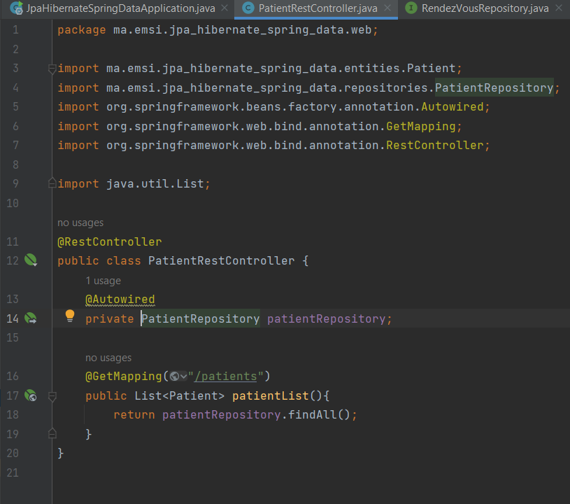

<h1>JPA Hibernate, Spring Data</h1>

 
<h3>1. Créer un projet Spring Initializer avec les dépendances JPA, H2, Spring Web et Lombok</h3>

 
<h3>2. Créer l'entité JPA Patient ayant les attributs : </h3>
      <h6> - id de type Long 
       - nom de type String 
       - dateNaissanec de type Date 
       - malade de type boolean 
       - score de type int</h6>

 
<h3>3. Configurer l'unité de persistance dans le ficher application.properties </h3>

 
<h3>4. Créer l'interface JPA Repository basée sur Spring data</h3>

 
<h3>5.  Tester quelques opérations de gestion de patients : </h3>
<h6>   - Ajouter des patients 
    - Consulter tous les patients 
    - Consulter un patient 
    - Chercher des patients 
    - Mettre à jour un patient  
    - supprimer un patient</h6>

 
<h3>6. Migrer de H2 Database vers MySQL</h3>

 
<h3>7. Les exemples  du Patient, Médecin, rendez-vous, consultation, users et roles</h3>

